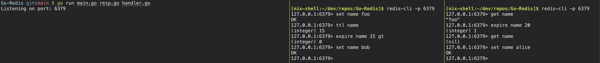

# Go-Redis
A mini Redis clone built in the Go programming language.

A small subset of the original Redis functions are implemented for basic testing, the database uses a key value data store, multiple clients can be used concurrently over the commands.
This project currently uses Go's runtime networking system which is `epoll` for Linux and `kqueue` on macOS.

The `TCP` server runs on port 6379 which provides direct client/server communication compatible with redis-cli. It allows concurrent client handling, able to accept multiple `TCP` clients and handle each connection independently with goroutines. 

`sync.RWMutex` is used around shared database state and atomic command operations for thread safe database access.

## Features
- `RESP2` protocol implementation from scratch, a custom parser and serializer for arrays, bulk strings, simple strings, integers, errors, and nulls.
- `GET` and `SET` methods to get and set keys and values.
- `HGET`, `HSET` and `HGETALL` methods for hashes.
- `EXPIRE` and `TTL` methods including `XN`, `XX`, `GT` and `LT` flags.
- Data persistence through `AOF`.
- In memory data storage using `map` from the Go standard library.
- Lazy key expiration, absolute expiration timestamps with expired-key cleanup on access.

## Parsing
- `Value` is the internal representation of the RESP value, from the client, the RESP is converted into an array of `Value` structs which is then used within the Redis server.

## Design

## Resources
https://stackoverflow.com/questions/36172745/how-does-redis-expire-keys
https://redis.io/
https://www.build-redis-from-scratch.dev/en/introduction
